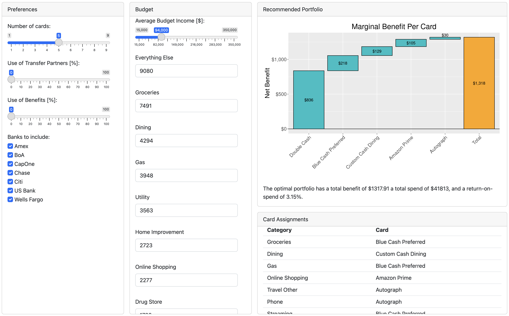

# Selecting the Optimal Credit Card Portfolio

Author: Remco A. Scheepmaker, Ph.D.

For my (second) Masters degree in Business Analytics from the University of Central Florida, I developed this Capstone Project on rewards credit cards, over the course of 11 weeks in the summer of 2024.

I developed an optimization algorithm that can be applied at scale to a large selection of credit cards, and to different types of consumers. 
In this [paper](RScheepmakerPaper.pdf) I present this algorithm, code it in `R`, and use it to model 'optimal' portfolios of rewards credit cards for various combinations of user preferences and spending characteristics. 
I then study the properties of these modeled portfolios, by combining data from the Bureau of Labor Statistics (BLS) on income and spending with data on credit card reward multipliers and values. 
By performing a sensitivity analysis, I find that spending on four to six credit cards is the sweet spot for most people, before the marginal benefit of adding more cards to the portfolio drops below $50. 
From a Monte Carlo simulation I find that the average return on spend (ROS) is 3.80 percent, with a standard deviation of 0.80 percent. 
In terms of ROS, the benefit of using credit cards can be significantly higher (up to 6.5 percent) for people who do not spend a lot but make full use of static benefits, such as travel credits and airport lounge access, or for people who spend above average on travel, since the travel categories have the highest (uncapped) point multipliers. 
Finally, I present a `Shiny` app that I developed in `R`, to serve as an
[online tool](https://remcoscheepmaker.shinyapps.io/ReMCCO/) that people can use to get a recommended credit card portfolio, based on their personal preferences and spending budget. 
This app can benefit many sophisticated credit card users who would like to stretch their budgets, travel more, or who simply enjoy optimizing their personal finances.

In order to run all the codes and 
reproduce my final paper, simply execute 
the `DoWork.sh` script by typing 
```
 ./DoWork.sh 
```
from the Project folder. 

The final paper will appear 
in the Project folder as [`RScheepmakerPaper.pdf`](RScheepmakerPaper.pdf)
